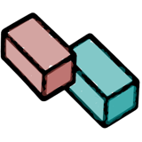

<p align="center"></p>

# Teal Brick Knowledge

Documents, memory and research for your agents, with data stored in your own deployment.

[Website](https://tealbrick.com) · [Portal](https://portal.tealbrick.com) · [Deployment](docs/deployment.md) · [Agent setup](adapters/agent/README.md) · [Release receipt](docs/standalone-release-0.1.0.md)

Knowledge 0.1.0 is an agent-first standalone release. The primary Railway
distribution is a source-backed service: Portal supplies the public repository
and a protected release branch fixed at the reviewed source commit, Railway builds it in the customer's project, and
Portal records the provider-resolved commit before accepting the deployment.
An OCI image may be published separately, but it is not required for the
source-backed path.

## What it does

- **Documents:** organize canonical documents and collections through the Knowledge API.
- **Memory:** store and retrieve knowledge through a bundled memory engine, with authenticated partition routing.
- **Research:** connect a separately configured research service for notebook sources, notes and chat.
- **Agent access:** connect compatible MCP clients or use the explicit Eve adapter with a scoped service credential.

Research requires separate service, model and notebook configuration. Provider-backed operations can incur provider charges. A healthy HTTP endpoint does not mean every integration is configured.

## Run from source

Use the Node and pnpm versions declared in [program/package.json](program/package.json). From this repository:

```sh
cd program
corepack pnpm@9.15.4 install --frozen-lockfile
corepack pnpm@9.15.4 test
corepack pnpm@9.15.4 build:web
corepack pnpm@9.15.4 dev
```

The development Program is not the public-facing authenticated deployment edge. Do not expose a development server directly to the Internet. See the [deployment guide](docs/deployment.md) for the container boundary and persistent storage.

To prepare a container build context without building or publishing:

```sh
KNOWLEDGE_EXPORT_ONLY=1 sh deploy/container/build-local.sh
```

To build locally with Docker:

```sh
sh deploy/container/build-local.sh tealbrick-knowledge:local-0.1.0
```

## Connect an agent

Follow [the agent adapter guide](adapters/agent/README.md) for MCP and Eve setup. Give each agent a scoped service credential and partition. Never give agents the instance administrator credential, hosting credentials or model-provider secrets.

Memory and Research have separate supported contracts. See [native memory operations](docs/native-memory-contract.md), [customer runtime authorization](docs/customer-runtime-auth.md), [per-edge memory partitions](docs/memory-partitions.md) and [Research agent access](docs/research-agent-contract.md).

## Storage and configuration

Mount a persistent volume at `/data` for container deployments. Keep each customer's data and secrets isolated. Back up persistent data before upgrades; an image rollback alone does not undo a database migration.

Without `KNOWLEDGE_DATA_DIR`, a source checkout stores data in `~/.tealbrick-knowledge`. An existing `~/.doppelganger-knowledge` is moved there once on the next Program start; if it cannot be moved (for example across filesystems) it stays in use and a warning is logged. `TEALBRICK_RUNTIME_FILE` replaces `DOPPELGANGER_RUNTIME_FILE`; the old name still works as deprecated aliases and log a warning.

Configuration is server-side. Start with [the environment example](program/.env.example), then follow [Research configuration](docs/open-notebook-connection.md) when enabling that integration. Do not place secrets in browser storage, URLs or agent tool arguments.

## Release status

> **0.4.x maintenance line.** Knowledge 0.4.5 is the only 0.4.x release that may run on a data
> directory that Knowledge 0.5.0 or later has used (0.5.0 writes random record ids). Never run
> 0.4.3 or 0.4.4 on such a data directory: they give new records duplicate ids. To go back from
> 0.5.0, use 0.4.5 or restore a backup taken before the upgrade.

The release evidence records source publication, optional image evidence,
adapter artifact, security review, and isolated persistence checks separately.
Container checks use synthetic providers and do not establish real model quality, complete
Research functionality, or human agent UAT. Portal-managed and standalone
deployments require separate acceptance. The archive security-trigger
verification remains restricted; see [OS backports and validation limits](deploy/container/OS-BACKPORTS.md).

## Contributing

See [CONTRIBUTING.md](CONTRIBUTING.md) for development checks, disposable fixtures and contribution scope.

## Licence and integrations

Tealbrick’s original contributions are licensed under the [MIT License](LICENSE). Upstream ownership and redistribution obligations are tracked separately. Bundled third-party code retains its own licences; see [third-party notices](THIRD_PARTY_NOTICES.md). The memory component uses GBrain; optional Research integration uses Open Notebook. Their configuration and version requirements are documented in the relevant guides.
